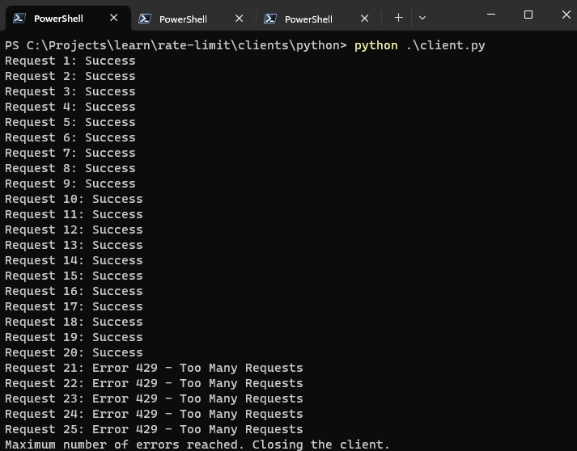

# Rate Limit

This repository is a rate limit implementation study, the idea is to create API and Clients in a few different languages to understand the difference between them and how they behave.

## About Rate Limit

Rate Limit is a good security practice for the API's, basically you define how many requests, originating from the same IP address, you want to accept in a time interval before blocking. The idea is to identify hostile traffic sources based on how often they are trying to access a resource.

## How to use

### Up the server

1. Access the `server` directory
2. Run `go mod tidy` command to install dependencies
3. Run the `go build` command to build the application
4. In the root of the project, execute the command `./hello_world.exe` to start the server
5. Access the API in the browser via the URL `http://localhost:8080/hello`

If everything went well you should get a `Hello, World!` return message.

### Up Clients

**Python**

Important: Before following the steps below, you must upload the server  

This client's code is programmed to make requests to the API until it receives 5 status code 409, that is, when it is blocked by the rate limit applied in the API.  

1. Go to the `clients/python` directory
2. Run the `pip install requests` command to install the library used to make HTTP requests
3. Run the command `python client.py` so that the requests are made.

## How to contribute

You can contribute to the source code in our [GitHub](https://github.com/leobaiano/rate-limit) page.

1. Take a [fork](https://help.github.com/articles/fork-a-repo/) repository;
3. [Configure your](https://help.github.com/articles/configuring-a-remote-for-a-fork/);
2. Check [issues](https://github.com/WordPressBeloHorizonte/horizon-theme/issues) and choose one that does not have anyone working;
4. [Sincronize seu fork](https://help.github.com/articles/syncing-a-fork/);
2. Create a branch to work on the issue of responsibility: `git checkout -b issue-17`;
3. Commit the changes you made: `git commit -m 'Review commits you did'`;
4. Make a push to branch: `git push origin issue-17`;
5. Make a [Pull Request](https://help.github.com/articles/using-pull-requests/) :D

**Note:** If you want to contribute to something that was not recorded in the [issues](https://github.com/leobaiano/rate-limit/issues) it is important to create and subscribe to prevent someone else to start working on the same thing you.

If you need help performing any of the procedures above, please access the link and [learn how to make a Pull Request](https://help.github.com/articles/creating-a-pull-request/).